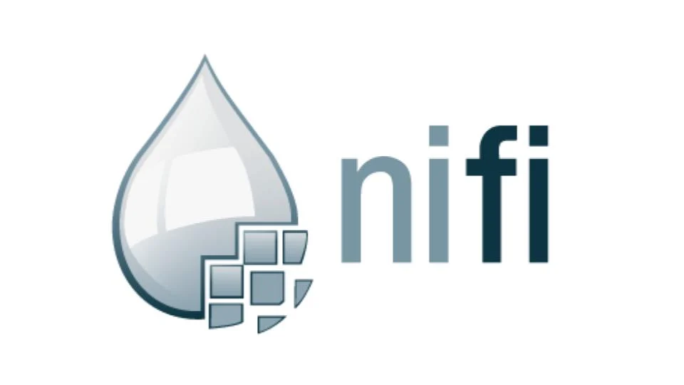

# Introdución a **Apache NiFi**

------------------------------------------------------------------------

## 1. Que é Apache NiFi?

Apache NiFi é unha plataforma de integración e movemento de datos en continuo desenvolvemento, deseñada para automatizar o fluxo de datos
entre sistemas. Está baseada no proxecto **Niagara Files** da NSA e está
pensada para manipular, enrutar, transformar e monitorizar fluxos de
datos en tempo real.

NiFi proporciona:

-   movemento fiable de datos,
-   transformación flexible,
-   unha interface gráfica moi intuitiva baseada en arrastrar e soltar,
-   control total de priorización e políticas de transferencia,
-   trazabilidade completa grazas ao sistema *Data Provenance*.

------------------------------------------------------------------------

## 2. Conceptos fundamentais en NiFi

### **FlowFile**

É a unidade básica de datos dentro de NiFi. Cada FlowFile contén: -
**Contido** (bytes) - **Atributos** (pares clave→valor)

### **Processor**

Son os "nodos" que realizan accións: - ler de fontes externas, -
transformar datos, - enrutar segundo condicións, - escribir en
destinos, - executar scripts, etc.

### **Relationship**

Cada Processor ten "saídas lóxicas" chamadas relationships: -
*success* - *failure* - *retry* - *not matched*, etc.

Serven para conectar procesadores entre si.

### **Connection**

Conecta dous procesadores e actúa como unha cola intermedia. Pode ter
límite de tamaño e políticas como FIFO, LIFO etc.

### **Process Group**

Permite agrupar partes dun fluxo para organizar mellor.

### **Controller Service**

Servizos compartidos reutilizables: - conexións S3/MinIO - conexións
JDBC - parsers de CSV - servizos de SSL - servizos de catálogo etc.

### **Data Provenance**

Permite inspeccionar cada paso polo que pasou un FlowFile: - de onde
veu, - que procesadores o modificaron, - cando, - con que parámetros.

Ideal para auditoría e depuración.

------------------------------------------------------------------------

## 3. Arquitectura de Apache NiFi

Apache NiFi está deseñado como unha aplicación modular e extensible construída enriba da JVM, optimizada para mover, transformar e monitorizar datos en fluxo. A súa arquitectura segue principios de *Flow-Based Programming* e organiza os seus compoñentes en capas lóxicas e repositorios persistentes.

---

## 🎛️ 3.1. Principios fundamentais  
🔗 https://nifi.apache.org/nifi-docs/overview.html

### 🔹 Flow-Based Programming
NiFi utiliza o paradigma no que os datos se moven a través de procesadores conectados. O usuario constrúe o fluxo graficamente e defínese:
- que procesadores se executan,
- como se conectan,
- que regras de roteo se aplican,
- como se almacenan e transforman os datos.

---

## 3.2. Arquitectura en niveis (vista lóxica)

### Web Server
- A interface gráfica (UI) está servida por un **Jetty web server**.
- Exponse mediante unha **API HTTP(S)** de control e administración.
- Permite deseñar fluxos, xestionar procesadores, monitorizar o sistema, etc.

### Flow Controller
O cerebro da plataforma:
- asigna **threads** aos procesadores,
- controla planificación e concorrencia,
- mantén a topoloxía do fluxo,
- xestiona back-pressure, prioridades e transaccións.

### Extensions Framework
NiFi permite cargar extensións mediante arquivos **NAR (NiFi Archive)**:
- Processors
- Controller Services
- Reporting Tasks
- Flow Analysis Rules
- Parameter Providers

As extensións funcionan dentro da JVM e amplían a funcionalidade da plataforma.

---

## 🗄️ 3.3. Repositorios internos

NiFi garante fiabilidade e trazabilidade mantendo tres repositorios principais:

### FlowFile Repository
Garda o **estado e metadatos** dos FlowFiles activos no fluxo.
- Implementación por defecto: **Write-Ahead Log**
- Función: permitir recuperación tras fallos do sistema.

### Content Repository
Onde se gardan os **bytes reais** do contido.
- Implementación por defecto: bloques en disco
- Pode distribuirse en varias particións para mellorar rendemento.

### Provenance Repository
Rexistra **todos os eventos** de cada FlowFile:
- creación
- roteo
- cambios
- escritura
- eliminación

Permite auditoría completa e trazabilidade do ciclo de vida dos datos.

---

## 3.4. Outros compoñentes internos

### Extensions
Procesadores e servizos que executan a lóxica do fluxo. Exemplos:
- PutS3Object
- ExecuteScript
- ConsumeMQTT
- PutHDFS

### Administrative Infrastructure
Encárgase de:
- planificación global,
- recuperación tras apagado,
- auto-carga de extensións,
- xestión de recursos e memoria.

---

## 3.5. Garantías de entrega

NiFi garante:

- **At-least-once delivery**
- Transaccións entre conexións
- Recuperación automática tras fallos
- Integridade en todo o ciclo de vida do FlowFile

---

## 3.6. Back Pressure e Prioritización

Para evitar saturación:
- cada conexión pode limitar número de FlowFiles e tamaño ocupado,
- cando un límite se supera → **Back Pressure** detén o procesador anterior,
- pódense configurar **prioritizadores**: FIFO, LIFO, oldest-first, etc.

---

## 3.7. Clustering

NiFi pode escalar horizontalmente:

- todos os nós executan o mesmo fluxo,
- Zookeeper coordina o clúster,
- un **nó líder** toma certas decisións administrativas,
- UI única para todo o clúster,
- balanceo e tolerancia a fallos.

---

## 3.8. Resumo da arquitectura

| Compoñente | Función |
|-----------|---------|
| **Web Server** | Servidor Jetty + API HTTP(S) para control |
| **Flow Controller** | Orquestrador central de execución |
| **Extensions** | Procesadores e servizos cargados en tempo de execución |
| **FlowFile Repository** | Metadatos e estado dos FlowFiles |
| **Content Repository** | Bytes reais do contido |
| **Provenance Repository** | Historial completo de eventos |
| **Cluster Manager (ZK)** | Coordinación dos nós dun clúster |

---

## 3.9. Resumo textual dos compoñentes segundo a documentación oficial

**Web Server**  
> Encárgase de ofrecer a API e a interface web.

**Flow Controller**  
> A lóxica central que asigna threads, planifica execución e controla o fluxo.

**Extensions**  
> Procesadores, servizos e tarefas que se executan na JVM.

**FlowFile Repository**  
> Onde se almacena o estado interno de cada FlowFile activo.

**Content Repository**  
> Almacén físico dos bytes dos FlowFiles no sistema de ficheiros.

**Provenance Repository**  
> Rexistro de todos os eventos e cambios que experimentou cada FlowFile.

**Clustering**  
> Os nodos poden unirse para formar un clúster coordinado por ZooKeeper.


------------------------------------------------------------------------

# 4. NiFi en Docker --- Configuración completa

A seguinte configuración está lista para engadir a un 
`docker-compose.yml`.

Hai que asegurarse de que estea na mesma rede que o resto de servizos e declarar os volumes ao final do documento.

Inclúe: - NiFi 2.5.0 (UI clásica, máis estable) - HTTPS - usuario


------------------------------------------------------------------------

## Servizo Docker (pegado literal, listo para usar)

``` yaml
  nifi:
    image: apache/nifi:2.5.0
    container_name: nifi
    hostname: nifi
    restart: unless-stopped
    depends_on:
      - minio
      - namenode

    ports:
      - "9091:8443"  # NiFi en https://localhost:9091/nifi

    environment:
      # Modo seguro por defecto (HTTPS)
      - NIFI_WEB_HTTPS_PORT=8443
      - NIFI_WEB_HTTPS_HOST=0.0.0.0

      # Proxy para que funcionen os enlaces internos da UI con port mapping
      - NIFI_WEB_PROXY_HOST=localhost:9091

      # Usuario único
      - SINGLE_USER_CREDENTIALS_USERNAME=admin
      - SINGLE_USER_CREDENTIALS_PASSWORD=Admin$BDA123!

      # JVM
      - NIFI_JVM_HEAP_INIT=512m
      - NIFI_JVM_HEAP_MAX=2g

      # UI clásica e funcionalidades estándar
      - NIFI_UI_BUNDLES_ENABLE=all
      - NIFI_STATELESS_ENABLED=false

    networks:
      - cluster

    volumes:
      - nifi_state:/opt/nifi/nifi-current/state
      - nifi_logs:/opt/nifi/nifi-current/logs
```

------------------------------------------------------------------------

# 5. Ola Mundo con NiFi

Este é o fluxo máis básico posible:

## Procesadores:

1️. **GenerateFlowFile**\
→ crea FlowFiles periódicos.

2️. **LogAttribute**\
→ escribe os atributos no log de NiFi.

### Configuración:

### **GenerateFlowFile**

-   *Custom Text* → `Ola mundo desde NiFi`
-   *Run Schedule* → `5 sec`
-   *Batch Size* → `1`

### **LogAttribute**

Para que se vexa o contido do *FlowFile* no log:
-   *Log payload* → `true`

### Conexión:

`GenerateFlowFile (success) → LogAttribute`

### Execución:

1.  Start en GenerateFlowFile\
2.  Start en LogAttribute\
3.  Mira os logs `docker logs -f nifi` (asumindo que ese e o nome do contedor).

------------------------------------------------------------------------

# Ola Mundo 2: Subir a MinIO 

Este fluxo crea un ficheiro e súbeo ao bucket `nifi-test` en MinIO.

## Procesadores:

1️. **GenerateFlowFile**\
2️. **UpdateAttribute**\
3️. **PutS3Object** (funcionando con MinIO via Controller Service)

------------------------------------------------------------------------

## Paso 1 --- GenerateFlowFile

-   *Custom Text*:\
    `Este é un ficheiro xerado automaticamente por NiFi`

------------------------------------------------------------------------

## Paso 2 --- UpdateAttribute

Engade atributos necesarios (o bucket ten que existir previamente):

  Atributo   Valor
  ---------- ---------------
  bucket     nifi-test
  filename   `nifi-${now():format('yyyyMMdd-HHmms')}.txt`


------------------------------------------------------------------------

## Paso 4 --- Configurar PutS3Object

-   **Bucket** → `${bucket}`
-   **Object Key** → `${filename}`
-   **Endpoint Override URL** → `http://minio:9000`
-   **Use Path Style Access** → `true`
-   **AWS Credentials Provider Service** → ... → `create new service`
  - Seleccionamos `AWSCredentialsProviderController` → `Add`
  - Volvemos clicar nos `...` → `Go to service`.
    - No servicio clicamos nos `...` e configuramos:
      - *Access Key ID* → `minioadmin` (cambiar por usuario de minio)
      - *Secret Access Key* → `minioadmin` (cambiar por contrasinal de minio).
    - Clicamos nos `...` → `Enable`
  - En `Relationships` poñemos todo a `Terminate`.

Conectar: `GenerateFlowFile → UpdateAttribute → PutS3Object`

------------------------------------------------------------------------

## Probar:

1.  Start todos os procesadores\
2.  Ver en http://localhost:9001 (MinIO)\
3.  Abrir o bucket `nifi-test`\
4.  Ver os ficheiros subidos

------------------------------------------------------------------------
# Bibliografía e Recursos

- **Apache NiFi Official Documentation**  
  https://nifi.apache.org/docs.html  
  Documentación oficial do proxecto: referencia completa de procesadores, API REST, configuración, clustering e seguridade.

- **NiFi User Guide**  
  https://nifi.apache.org/docs/nifi-docs/html/user-guide.html  
  Explica o funcionamento básico da interface, FlowFiles, Connections, Process Groups e conceptos fundamentais.

- **NiFi Administration Guide**  
  https://nifi.apache.org/docs/nifi-docs/html/administration-guide.html  
  Guía centrada en instalación, rendemento, tuning, configuración de repositorios e modo cluster.

- **NiFi Expression Language Guide**  
  https://nifi.apache.org/docs/nifi-docs/html/expression-language-guide.html  
  Referencia esencial para crear rutas dinámicas, transformar atributos e empregar funcións EL.

- **NiFi Record-Based Processing Guide**  
  https://nifi.apache.org/docs/nifi-docs/html/record-path-guide.html  
  Imprescindible para traballar con Readers, Writers e Record Path.

- **Apache NiFi Registry Documentation**  
  https://nifi.apache.org/registry.html  
  Documentación sobre versionado de fluxos e integración con NiFi Registry.

- **Apache NiFi Stateless Documentation**  
  https://nifi.apache.org/docs/nifi-docs/html/stateless-guide.html  
  Guía sobre execución stateless ideal para integración con Airflow ou contornos serverless.

- **Libro: *Flow-Based Programming* — J. Paul Morrison**  
  A base conceptual detrás do deseño de NiFi e outros sistemas baseados en fluxo.

- **Artigo técnico: "NiFi Best Practices" (Cloudera/Community)**  
  https://community.cloudera.com/t5/Community-Articles/NiFi-Best-Practices/ta-p/248233  
  Colección de boas prácticas e patróns de deseño recomendados para fluxos complexos.


